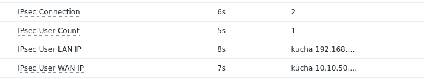

# ipsec-zabbix-openwrt
The scripts are intended for monitoring ipsec in OpenWrt router



Latest Data Sections


Graph

# Installation
1. Clone this repository
```
git clone https://github.com/heshgggg/ipsec-zabbix-openwrt; cd ipsec-zabbix-openwrt
```
2. Copy all scripts to somepath
```
cp -r * /somepath/
```
3. Set UserParameter on zabbix_agentd.conf
```
...
UserParameter=ipsec.connections,/somepath/ipsecEst.sh
UserParameter=ipsec.usercount,/somepath/usercount.sh
UserParameter=ipsec.username,/somepath/username.sh
UserParameter=ipsec.userwanip,/somepath/userwanip.sh
UserParameter=ipsec.userlanip,/somepath/user.sh
...
```
4. Restart zabbix_agent
```
/etc/init.d/zabbix_agentd restart
```
5. Import Zabbix Template from this repository xml file


Tested on Openwrt 24.10 and zabbix 7.2 
